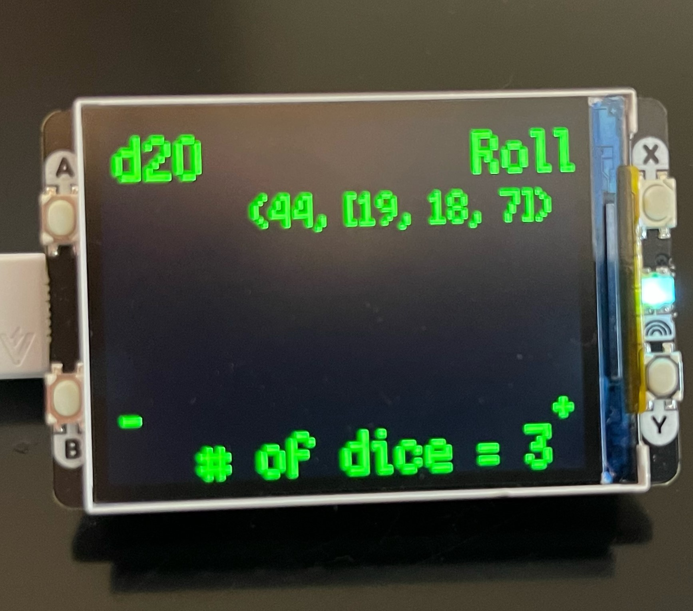

# pico-roll
RPI Pico Dice Rolling Script

This is a simple script to emulate standard D&D style dice on a Raspberry Pi Pico.

To use this script, you'll need[a Pimoroni Pico Display pack 2.](https://shop.pimoroni.com/products/pico-display-pack-2-0?variant=39374122582099)
Once you have the Pimoroni micropython image flashed onto your pico, you can save this script as main.py onto the board to run it at boot.
## Usage
The A Button selects from [d4, d6, d8, d10, d12], the B & Y buttons remove and add dice respectively, and the X button rolls the dice.

## Todo
- [ ] Make an animation for actual dice rolling
- [ ] Store more than one previous result
- [ ] Fix word wrapping
